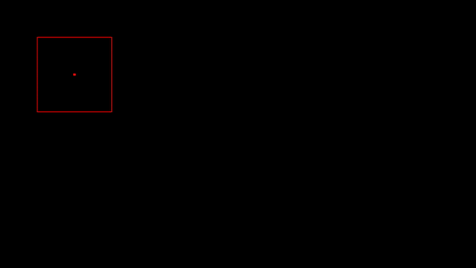

# BoundingBox Easing

**Description:** If you ever used the different `transition`-based CSS properties before, you will know the importance of ease functions for animations. This code base simply reimplements easing functions to a linear interpolation of a moving bounding box. You give the code a new and old position/size bounding box, and it will generate a list of interpolated positions/sizes that fit a certain ease function. By default, the bezier function used is `ease` ([visualization link](https://cubic-bezier.com/#.25,.1,.25,1))

**TODO:** Write concept explanation.